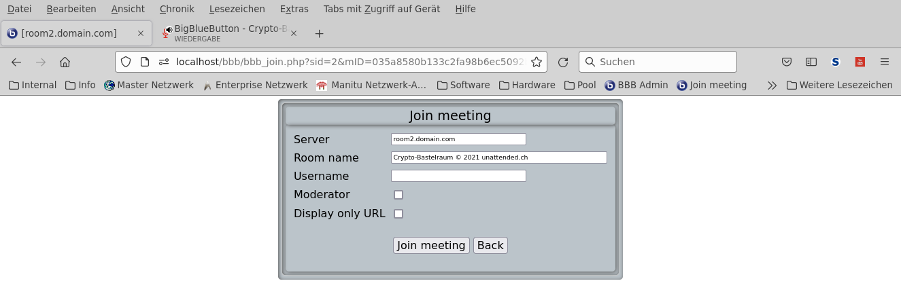

### NAME

       bbbadmin - BBB PHP API Frontend

### DESCRIPTION

       bbbadmin is a minimalistic BBB PHP API Frontend

### SYNOPSIS

       - Create webpage for administrators to manage BigBlueButton servers via the BBB PHP API

       - Manage all running meetings on the server not only the Greenlight stuff

### OPTIONS

       - List running meeting

       - List recordings

       - Create meetings

       - Join meeting

       - Stop meeting

       - Show meeting information

### FILES

       bbb_config.php                        Configuration file for application
       bbb_load.php                          Loading needed addons and additional scripts
       bbb_index.php                         Index page for application
       bbb_create.php                        Create meeting on server
       bbb_join.php                          Join meeting on server
       bbb_info.php                          Display meeting informations
       bbb_record.php                        Show recordings on server
       bbb_delrec.php                        Delete recordings on server
       bbb_stop.php                          Stop meeting on server

### INSTALLATION

    - Clone bbbadmin to your home folder
      git clone https://github.com/unattended-ch/bbbadmin

    - Clone the BBB PHP API to your home folder
      git clone https://github.com/bigbluebutton/bigbluebutton-api-php

    - Copy BBB contents of folder src/ to /var/www/yourpage
      rsync -avr ~/bigbluebutton-api-php/src/* /var/www/yourpage/

    - Copy bbbadmin *.php, *.css and icons/*.ico files to /var/www/yourpage
      rsync --exclude="*.png" --exclude="*.sql" -avr ~/bbbadmin/* /var/www/yourpage/

    - Create a symbolic link to the apache root folder
      ln -s /var/www/html/yourpage /var/www/yourpage

    - Install PHP modules php-curl php-mbstring php-xml
      sudo apt install php-curl php-mbstring php-xml -y

    - For configuration you can use the arrays in [bbb_config.php] as standalone configuration,
      or a mySql-Database for configuration [sql/bbbadmin.sql] to build the arrays

    - For standalone use configure [bbb_config.php]
      You must specify BBB_* Apache environment variables for every server

    - For database use configure and import the dump from [sql/bbbadmin.sql]
      There is no need to specify Apache environment variables there are loaded from database

### CONFIGURATION

- [bbb_config.php](bbb_config.php)

- [sql/bbbadmin.sql](sql/bbbadmin.sql)

