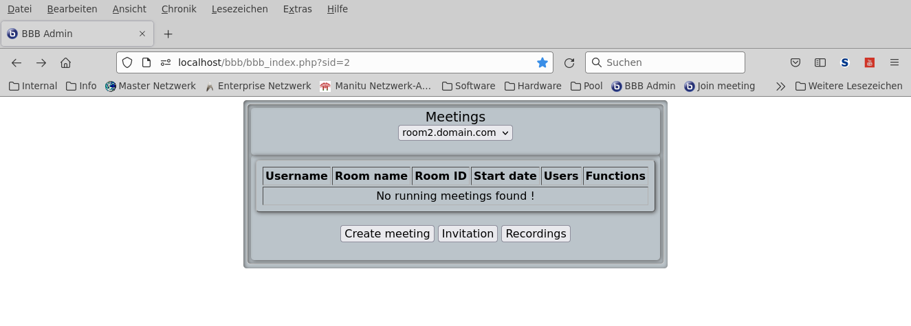

# BigBlueButton Admin- & User-Frontend

[](https://php.net/)
[](https://php.net/)
[](https://php.net/)
[](https://php.net/)
[](https://php.net/)
#### [[BigBlueButton Homepage][bbb]] [[BigBlueButton PHP API][bbbapi]]
#### [[Discussion][bbbadmin_discuss]] [[Changelog][changelog]]

<a name="tok"></a>

<!-- TABLE OF CONTENTS -->
<details open="open">
  <summary><h2 style="display: inline-block">TABLE OF CONTENTS</h2></summary>
  <ol>
    <li><a href="#">About bbbadmin</a>
      <ul>
        <li><a href="#php">Built with PHP</a></li>
      </ul>
    </li>
    <li><a href="#description">Description</a></li>
    <li><a href="#synopsis">Synopsis</a><ul>
        <li><a href="#options">Options</a></li>
        <li><a href="#php-files">Files</a></li>
        <li><a href="#prerequisites">Prerequisites</a></li>
        <li><a href="#releases">Releases</a></li>
        <li><a href="#installation-scripts">Installation Scripts</a></li>
        <li><a href="#installation-admin-frontend">Installation Admin Frontend</a></li>
        <li><a href="#htpasswd">Admin access security with .htpasswd</a></li>
        <li><a href="#installation-user-frontend">Installation User Frontend</a></li>
        <li><a href="#htpasswd">User access security with .htpasswd</a></li>
        <li><a href="#workaround">Workaround for hostings without apache_setenv()</a></li>
        <li><a href="#configuration-files">Configuration files</a></li>
        <li><a href="#language-support">Language support</a></li>
        <li><a href="#styling">Styling with bootstrap.css</a></li>
      </ul></li>
    <li><a href="#userurl">User URL for joining meeting</a></li>
    <li><a href="#styling">Change page style</a></li>
    <li><a href="#screenshots">Screenshots</a><ul>
        <li><a href="#bbb_index.png">bbb_index.php</a></li>
        <li><a href="#bbb_creat>bbb_create.php></li>
        <li><a href="#bbb_join.png">bbb_join.php</a></li>
        <li><a href="#bbb_info.png">bbb_info.php</a></li>
        <li><a href="#bbb_record.png">bbb_record.php</a></li>
        <li><a href="#bbb_user.png">bbb_user.php</a></li>
        <li><a href="#bbb_index.png">bbb_index.php</a></li>
    </ul></li>
    <li><a href="#todo">Todo</a></li>
  </ol>
</details>


## NAME

#### &nbsp;&nbsp;&nbsp;&nbsp;&nbsp;&nbsp;bbbadmin - BigBlueButton Admin- & User-Frontend

## DESCRIPTION

#### &nbsp;&nbsp;&nbsp;&nbsp;&nbsp;&nbsp;bbbadmin is a minimalistic BBB PHP API Frontend

## SYNOPSIS

   * 	Create webpage for administrators to manage BigBlueButton servers via the BBB PHP API
   * 	Create webpage for users only to join BigBlueButton server
   * 	Manage all running meetings on the server
   * 	Manage all recordings on the server
   * 	Provide central user join page for meetings

   [goto TOK](#tok)

## OPTIONS

   * List running meeting
   * List recordings
   * Create meetings
   * Join meeting
   * Stop meeting
   * Show meeting information
   * Show recordings
   * Delete recordings

   [goto TOK](#tok)

## PHP FILES

   Filename|Description
   --------|-----------
   bbb_config.php|Configuration file for application
   bbb_load.php|Loading needed addons and additional scripts
   bbb_index.php|Index page for application
   bbb_create.php|Create meeting on server
   bbb_join.php|Join meeting on server
   bbb_info.php|Display meeting informations
   bbb_record.php|Show recordings on server
   bbb_delrec.php|Delete recordings on server
   bbb_stop.php|Stop meeting on server
   bbb_user.php|Join user to meeting
   sql/bbbadmin.sql|SQL dump for bbbadmin database

   [goto TOK](#tok)

## CONFIGURATION FILES

- Configuration file [bbb_admin.json]

- Folder protection file [.htaccess]

- Access password file [.htpasswd]

   [goto TOK](#tok)

## LANGUAGE SUPPORT

- Change [$language='en'] in [bbb_config.php] to your language shortcode

- See [res/locale/][bbb_lang] for .PO translation files
  and translation scripts

- See [locale/][bbb_locale] for translated .PHP files

   [goto TOK](#tok)

## STYLING

- Use bootstrap.css for styling of bbb_user.php

## RELEASES

- See [releases]

## INSTALLATION SCRIPTS

- Admin Frontend installation script [bbbadmin_install.sh]

- User Frontend installation script [bbbuser_install.sh]

   [goto TOK](#tok)

## PREREQUISITES

1. Install PHP modules php-curl php-mbstring php-xml
   ```sh
     sudo apt install php-curl php-mbstring php-xml -y
   ```

   [goto TOK](#tok)

## INSTALLATION ADMIN FRONTEND

1. Clone bbbadmin to your home folder
   ```sh
     git clone https://github.com/unattended-ch/bbbadmin ~/bbbadmin
   ```
2. Clone the BBB PHP API to your home folder
   ```sh
     git clone https://github.com/bigbluebutton/bigbluebutton-api-php ~/bigbluebutton-api-php
   ```
3. Copy BBB contents of folder src/ to /var/www/yourpage
   ```sh
     sudo rsync -avr ~/bigbluebutton-api-php/src/* /var/www/yourpage/
   ```
4. Copy bbbadmin *.php, *.css and icons/*.ico files to /var/www/yourpage
   ```sh
     sudo rsync --exclude="res/*" --exclude="*.sql" -avr ~/bbbadmin/* /var/www/yourpage/
   ```
5. Create a symbolic link to the apache root folder
   ```sh
     sudo ln -s /var/www/yourpage /var/www/html/yourpage
   ```
6. Set owner of yourpage to www-data
   ```sh
     sudo chown -R www-data.www-data /var/www/yourpage
   ```
7. For configuration you can use [bbb_admin.json]
   - You must specify BBB_* Apache environment variables for every server in apache configuration
     ```
       SetEnv BBB_SECRET1 XXXXXXXXXXXXXXXXXXXXXXXXXXXXXXXXXXXXX
       SetEnv BBB_SERVER1_BASE_URL https://server1.domain.com/bigbluebutton/
       SetEnv BBB_SECRET2 XXXXXXXXXXXXXXXXXXXXXXXXXXXXXXXXXXXXX
       SetEnv BBB_SERVER2_BASE_URL https://server2.domain.com/bigbluebutton/
     ```
8. Enable access security over .htpasswd file as a basic protection
   <a name="htpasswd"></a>
   8.1 Add th following to the default apache configuration
   ```
     <Directory "/var/www/html/yourpage">
       AllowOverride All
       Options SymLinksIfOwnerMatch IncludesNoExec
       Order allow,deny
       Allow from all
     </Directory>
   ```
   8.2 Copy .htacces file to your webpage
   ```sh
     sudo cp -v ~/bbbadmin/res/.htaccess /var/www/youpage/
   ```
   8.3 Edit the path of password file in [.htaccess], always use document root
   ```sh
     sudo mcedit /var/www/html/yourpage/.htaccess
     
     AuthUserFile "/var/www/html/yourpage/.htpasswd"
   ```
   8.4 Add user to .htpasswd
   ```sh
     sudo htpasswd -c /var/www/youpage/.htpasswd [username]
   ```
   8.5 Restart apache server
   ```sh
     sudo systemctl restart apache2
   ```

   [goto TOK](#tok)

## INSTALLATION USER FRONTEND

1. Clone bbbadmin to your home folder
   ```sh
     git clone https://github.com/unattended-ch/bbbadmin ~/bbbadmin
   ```
2. Clone the BBB PHP API to your home folder
   ```sh
     git clone https://github.com/bigbluebutton/bigbluebutton-api-php ~/bigbluebutton-api-php
   ```
3. Copy BBB contents of folder src/ to /var/www/youruserpage
   ```sh
     sudo rsync -avr ~/bigbluebutton-api-php/src/* /var/www/youruserpage/
   ```
4. Copy bbbadmin *.php, *.css and icons/*.ico files to /var/www/youruserpage
   ```sh
     sudo rsync --exclude="res/*" --exclude="*.sql" -avr ~/bbbadmin/* /var/www/youruserpage/
     sudo mv -v /var/www/youruserpage/bbb_user.php /var/www/youruserpage/index.php
   ```
5. Remove not needed files
   ```sh
     sudo rm -f /var/www/youruserpage/bbb_create.php
     sudo rm -f /var/www/youruserpage/bbb_delrec.php
     sudo rm -f /var/www/youruserpage/bbb_index.php
     sudo rm -f /var/www/youruserpage/bbb_info.php
     sudo rm -f /var/www/youruserpage/bbb_join.php
     sudo rm -f /var/www/youruserpage/bbb_record.php
     sudo rm -f /var/www/youruserpage/bbb_stop.php
   ```
6. Create a symbolic link to the apache root folder
   ```sh
     sudo ln -s /var/www/yourpage /var/www/html/youruserpage
   ```
7. Set owner of youruserpage to www-data
   ```sh
     sudo chown -R www-data.www-data /var/www/youruserpage
   ```
8. For configuration you can edit [bbb_admin.json]
   - You must specify BBB_* Apache environment variables for every server
     ```
       SetEnv BBB_SECRET1 XXXXXXXXXXXXXXXXXXXXXXXXXXXXXXXXXXXXX
       SetEnv BBB_SERVER1_BASE_URL https://server1.domain.com/bigbluebutton/
       SetEnv BBB_SECRET2 XXXXXXXXXXXXXXXXXXXXXXXXXXXXXXXXXXXXX
       SetEnv BBB_SERVER2_BASE_URL https://server2.domain.com/bigbluebutton/
     ```
9. Workaround for servers with no apapche_set() and apache_getenv() support
   9.1 Edit users [index.php](bbb_user.php)
     <a name="workaround"></a>
     ```
        $bbb = new BigBlueButton();
    replace it with
        $bbb = new BigBlueButton($bbb_url, $bbb_salt);

     ```
   9.2 Edit [bbb_config.php]
     ```
        apache_setenv('BBB_SECRET', apache_getenv('BBB_SECRET1'));
        apache_setenv('BBB_SERVER_BASE_URL', apache_getenv('BBB_SERVER1_BASE_URL'));
      replace it with
        //apache_setenv('BBB_SECRET', apache_getenv('BBB_SECRET1'));
        //apache_setenv('BBB_SERVER_BASE_URL', apache_getenv('BBB_SERVER1_BASE_URL'));
        $bbb_url  = 'https://domain1.com/bigbluebutton/';
        $bbb_salt = 'XXXXXXXXXXXXXXXXXXXXXXXXXXXXXXX';
      
        apache_setenv('BBB_SECRET', apache_getenv('BBB_SECRET1'));
        apache_setenv('BBB_SERVER_BASE_URL', apache_getenv('BBB_SERVER1_BASE_URL'));
      replace it with
        //apache_setenv('BBB_SECRET', apache_getenv('BBB_SECRET2'));
        //apache_setenv('BBB_SERVER_BASE_URL', apache_getenv('BBB_SERVER2_BASE_URL'));
        $bbb_url  = 'https://domain2.com/bigbluebutton/';
        $bbb_salt = 'XXXXXXXXXXXXXXXXXXXXXXXXXXXXXXX';
     ```
   9.3 Edit [BigBlueButton.php]
     ```
        $this->securitySecret   = $secret ?: getenv('BBB_SECRET') ?: getenv('BBB_SECURITY_SALT');
        $this->bbbServerBaseUrl = $baseUrl ?: getenv('BBB_SERVER_BASE_URL');
      replace it with
        //$this->securitySecret   = $secret ?: getenv('BBB_SECRET') ?: getenv('BBB_SECURITY_SALT');
        //$this->bbbServerBaseUrl = $baseUrl ?: getenv('BBB_SERVER_BASE_URL');
     ```
10. User can now join the meeting with the following parameters (sid and mID is needed the rest is optional) :
   ```
     https://server.domain.com/bbbuser/bbb_user.php?sid=X&mID=XXXXXXXXXXXXXXXXXX[&usr=Username][&join=1]
   or
     https://server.domain.com?sid=X&mID=XXXXXXXXXXXXXXXXXX[&usr=Username][&join=1]
   ```

   [goto TOK](#tok)

## STYLING

- Change your page style with the CSS file [style.css]

   [goto TOK](#tok)

## SCREENSHOTS
<a name="bbb_index.png"></a>
   - bbb_index.php
   
   [goto TOK](#tok)

   - bbb_index.php
   
   [goto TOK](#tok)

<a name="bbb_create.png"></a>
   - bbb_create.php
   
   [goto TOK](#tok)

<a name="bbb_join.png"></a>
   - bbb_join.php
   
   [goto TOK](#tok)

<a name="bbb_info.png"></a>
   - bbb_info.php
   
   [goto TOK](#tok)

<a name="bbb_stop.png"></a>
   - bbb_stop.php
   
   [goto TOK](#tok)

<a name="bbb_record.png"></a>
   - bbb_record.php
   
   [goto TOK](#tok)

<a name="bbb_user.png"></a>
   - bbb_user.php
   
   [goto TOK](#tok)

<a name="todo"></a>
## TODO

   1. Enjoy
   2. Create JSON files for configuration
   3. Send invite links via email
   4. Display 1st page of presentation as background on users join page (would be nice...and i am willing)
   5. Create download location for .MP4 meeting recording files in BBB (a lot of scripts...but i [need help][discuss])
   6. Add database manipulation scripts (for now we use [webmin][webmin] for this...)
   7. Create cron srcipt to start meeting in timely fashion for a specific time period (we need this really ?)

   - You can take part of [discussion][discuss]
   - Or you can send us [issue reports][issues]

   [goto TOK](#tok)

[bbbadmin_install.sh]: res/bbbadmin_install.sh
[bbbuser_install.sh]: res/bbbuser_install.sh
[bbbadmin.sql]: sql/bbbadmin.sql
[bbb_config.php]: bbb_config.php
[bbb_lang]: res/locale/
[bbb_locale]: locale/
[releases]: releases/
[changelog]: CHANGELOG
[bbb_admin.json]: bbb_admin.json
[bbbadmin_discuss]: https://github.com/unattended-ch/bbbadmin/discussions
[bbb]: https://bigbluebutton.org/
[bbbapi]: https://github.com/bigbluebutton/bigbluebutton-api-php
[.htaccess]: res/.htaccess
[style.css]: css/style.css
[discuss]: https://github.com/unattended-ch/bbbadmin/discussions
[issues]: https://github.com/unattended-ch/bbbadmin/issues
[webmin]: https://www.webmin.com/
