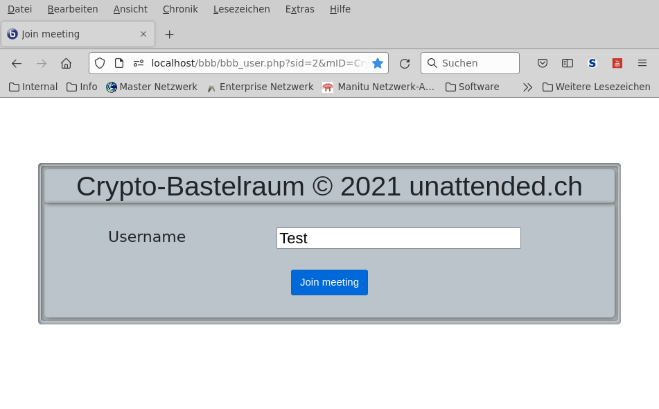

# BigBlueButton Admin- & User-Frontend

[](https://php.net/)
[](https://php.net/)
[](https://php.net/)
[](https://php.net/)
[](https://php.net/)
#### [[BigBlueButton Homepage][bbb]] [[BigBlueButton PHP API][bbbapi]]
#### [[bbbadmin Discussion][bbbadmin_discuss]]

<!-- TABLE OF CONTENTS -->
<details open="open">
  <summary><h2 style="display: inline-block">TABLE OF CONTENTS</h2></summary>
  <ol>
    <li>
      <a href="#">About bbbadmin</a>
      <ul>
        <li><a href="#php">Built with PHP</a></li>
      </ul>
    </li>
    <li>
      <a href="#description">Description</a>
    </li>
    <li>
      <a href="#synopsis">Synopsis</a>
      <ul>
        <li><a href="#options">Options</a></li>
        <li><a href="#files">Files</a></li>
        <li><a href="#prerequisites">Prerequisites</a></li>
        <li><a href="#installation-scripts">Installation Scripts</a></li>
        <li><a href="#installation-admin-frontend">Installation Admin Frontend</a></li>
        <li><a href="#installation-user-frontend">Installation User Frontend</a></li>
        <li><a href="#configuration">Configuration</a></li>
        <li><a href="#language-support">Language support</a></li>
      </ul>
    </li>
    <li><a href="#screenshots">Screenshots</a></li>
    <li><a href="#todo">Todo</a></li>
  </ol>
</details>


## NAME

#### &nbsp;&nbsp;&nbsp;&nbsp;&nbsp;&nbsp;bbbadmin - BigBlueButton Admin- & User-Frontend

## DESCRIPTION

#### &nbsp;&nbsp;&nbsp;&nbsp;&nbsp;&nbsp;bbbadmin is a minimalistic BBB PHP API Frontend

## SYNOPSIS

   * 	Create webpage for administrators to manage BigBlueButton servers via the BBB PHP API
   * 	Create webpage for users only to join BigBlueButton server
   * 	Manage all running meetings on the server
   * 	Manage all recordings on the server

## OPTIONS

   * List running meeting
   * List recordings
   * Create meetings
   * Join meeting
   * Stop meeting
   * Show meeting information
   * Show recordings
   * Delete recordings

## FILES

   Filename|Description
   --------|-----------
   bbb_config.php|Configuration file for application
   bbb_load.php|Loading needed addons and additional scripts
   bbb_index.php|Index page for application
   bbb_create.php|Create meeting on server
   bbb_join.php|Join meeting on server
   bbb_info.php|Display meeting informations
   bbb_record.php|Show recordings on server
   bbb_delrec.php|Delete recordings on server
   bbb_stop.php|Stop meeting on server
   bbb_user.php|Join user to meeting
   sql/bbbadmin.sql|SQL dump for bbbadmin database

## CONFIGURATION SCRIPTS

- Configuration file [bbb_config.php]

- SQL dump [bbbadmin.sql]

## LANGUAGE SUPPORT

- Change [$language='en'] in [bbb_config.php] to your language shortcode

- See [res/locale/][bbb_lang] for .PO translation files
  and translation scripts

- See [locale/][bbb_locale] for translated .PHP files

## INSTALLATION FILES

- Admin Frontend installation script [bbbadmin_install.sh]

- User Frontend installation script [bbbuser_install.sh]

## PREREQUISITES

1. Install PHP modules php-curl php-mbstring php-xml
   ```sh
   sudo apt install php-curl php-mbstring php-xml -y
   ```

## INSTALLATION ADMIN FRONTEND

1. Clone bbbadmin to your home folder
   ```sh
   git clone https://github.com/unattended-ch/bbbadmin ~/bbbadmin
   ```
2. Clone the BBB PHP API to your home folder
   ```sh
   git clone https://github.com/bigbluebutton/bigbluebutton-api-php ~/bigbluebutton-api-php
   ```
3. Copy BBB contents of folder src/ to /var/www/yourpage
   ```sh
   sudo rsync -avr ~/bigbluebutton-api-php/src/* /var/www/yourpage/
   ```
4. Copy bbbadmin *.php, *.css and icons/*.ico files to /var/www/yourpage
   ```sh
   sudo rsync --exclude="res/*" --exclude="*.sql" -avr ~/bbbadmin/* /var/www/yourpage/
   ```
5. Create a symbolic link to the apache root folder
   ```sh
   sudo ln -s /var/www/yourpage /var/www/html/yourpage
   ```
6. Set owner of yourpage to www-data
   ```sh
   sudo chown -R www-data.www-data /var/www/yourpage
   ```
7. For configuration you can use the arrays in [bbb_config.php] as standalone configuration
   or a mySql-Database for configuration [bbbadmin.sql] to build the arrays

   7.1. For standalone use configure [bbb_config.php]
   - Edit [bbb_config.php]
     ```
       database=""
     ```
   - You must specify BBB_* Apache environment variables for every server
     ```
       SetEnv BBB_SECRET1 XXXXXXXXXXXXXXXXXXXXXXXXXXXXXXXXXXXXX
       SetEnv BBB_SERVER1_BASE_URL https://server1.domain.com/bigbluebutton/
       SetEnv BBB_SECRET2 XXXXXXXXXXXXXXXXXXXXXXXXXXXXXXXXXXXXX
       SetEnv BBB_SERVER2_BASE_URL https://server2.domain.com/bigbluebutton/
     ```
   7.2. For database configure and import the dump from [bbbadmin.sql]
   - Edit [bbbadmin.sql]
     ```
       mcedit ~/bbbadmin/sql/bbbadmin.sql
     ```
   - Import database to mysql
     ```
       mysql -u username -p bbbadmin < ~/bbbadmin/sql/bbbadmin.sql
     ```
   - There is no need to specify Apache environment variables


## INSTALLATION USER FRONTEND

1. Clone bbbadmin to your home folder
   ```sh
   git clone https://github.com/unattended-ch/bbbadmin ~/bbbadmin
   ```
2. Clone the BBB PHP API to your home folder
   ```sh
   git clone https://github.com/bigbluebutton/bigbluebutton-api-php ~/bigbluebutton-api-php
   ```
3. Copy BBB contents of folder src/ to /var/www/youruserpage
   ```sh
   sudo rsync -avr ~/bigbluebutton-api-php/src/* /var/www/youruserpage/
   ```
4. Copy bbbadmin *.php, *.css and icons/*.ico files to /var/www/youruserpage
   ```sh
   sudo rsync --exclude="res/*" --exclude="*.sql" -avr ~/bbbadmin/* /var/www/youruserpage/
   sudo rm -f /var/www/youruserpage/bbb_create.php
   sudo rm -f /var/www/youruserpage/bbb_delrec.php
   sudo rm -f /var/www/youruserpage/bbb_index.php
   sudo rm -f /var/www/youruserpage/bbb_info.php
   sudo rm -f /var/www/youruserpage/bbb_join.php
   sudo rm -f /var/www/youruserpage/bbb_record.php
   sudo rm -f /var/www/youruserpage/bbb_stop.php
   ```
5. Create a symbolic link to the apache root folder
   ```sh
   sudo ln -s /var/www/yourpage /var/www/html/youruserpage
   ```
6. Set owner of youruserpage to www-data
   ```sh
   sudo chown -R www-data.www-data /var/www/youruserpage
   ```
7. For configuration you can use the arrays in [bbb_config.php] as standalone configuration
   or a mySql-Database for configuration [bbbadmin.sql] to build the arrays

   7.1. For standalone use configure [bbb_config.php]
   - Edit [bbb_config.php]
     ```
       database=""
     ```
   - You must specify BBB_* Apache environment variables for every server
     ```
       SetEnv BBB_SECRET1 XXXXXXXXXXXXXXXXXXXXXXXXXXXXXXXXXXXXX
       SetEnv BBB_SERVER1_BASE_URL https://server1.domain.com/bigbluebutton/
       SetEnv BBB_SECRET2 XXXXXXXXXXXXXXXXXXXXXXXXXXXXXXXXXXXXX
       SetEnv BBB_SERVER2_BASE_URL https://server2.domain.com/bigbluebutton/
     ```
   7.2. For database configure and import the dump from [bbbadmin.sql]
   - Edit [bbbadmin.sql]
     ```
       mcedit ~/bbbadmin/sql/bbbadmin.sql
     ```
   - Import database to mysql
     ```
       mysql -u username -p bbbadmin < ~/bbbadmin/sql/bbbadmin.sql
     ```
   - There is no need to specify Apache environment variables

8. User can now join the meeting with serverid and meetingID
   ```
   https://server.domain.com/bbbuser/bbb_user.php?serverid=X&meetingID=XXXXXXXXXXXXXXXXXX
   ```

## SCREENSHOTS
   - bbb_index.php
   

   - bbb_create.php
   

   - bbb_index.php
   

   - bbb_join.php
   

   - bbb_info.php
   

   - bbb_stop.php
   

   - bbb_record.php
   

   - bbb_user.php
   

## TODO

   * Create cron srcipt to start meeting in timely fashion for a spefic time period
   * Create download location for .MP4 meeting recording files in BBB
   * Add database manipulation scripts, for now we use webmin for this
   * Enjoy

[bbbadmin_install.sh]: res/bbbadmin_install.sh
[bbbuser_install.sh]: res/bbbuser_install.sh
[bbbadmin.sql]: sql/bbbadmin.sql
[bbb_config.php]: bbb_config.php
[bbb_lang]: res/locale/
[bbb_locale]: locale/
[bbbadmin_discuss]: https://github.com/unattended-ch/bbbadmin/discussions
[bbb]: https://bigbluebutton.org/
[bbbapi]: https://github.com/bigbluebutton/bigbluebutton-api-php