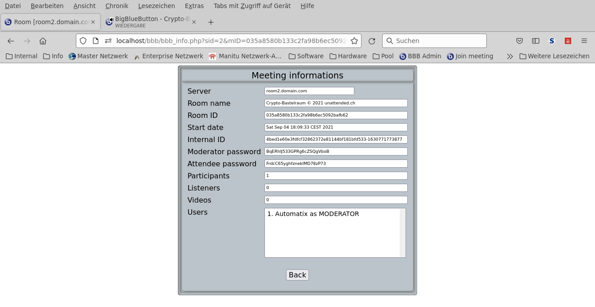

[](https://php.net/)
[](https://php.net/)
[](https://php.net/)
[](https://php.net/)
[](https://php.net/)

<!-- TABLE OF CONTENTS -->
<details open="open">
  <summary><h2 style="display: inline-block">Table of Contents</h2></summary>
  <ol>
    <li>
      <a href="#">About The Project</a>
      <ul>
        <li><a href="#">Built With PHP</a></li>
      </ul>
    </li>
    <li>
      <a href="#description">Description</a>
    </li>
    <li>
      <a href="#Synopsis">Synopsis</a>
      <ul>
        <li><a href="#installation">Installation</a></li>
        <li><a href="#configuration">Configuration</a></li>
      </ul>
    </li>
    <li><a href="#options">Options</a></li>
    <li><a href="#files">Files</a></li>
    <li><a href="#pages">Pages</a></li>
    <li><a href="#todo">Todo</a></li>
  </ol>
</details>

### NAME

       bbbadmin - BigBlueButton Admin Frontend

### DESCRIPTION

       bbbadmin is a minimalistic BBB PHP API Frontend


### SYNOPSIS

       - Create webpage for administrators to manage BigBlueButton servers via the BBB PHP API
       - Manage all running meetings on the server
       - Manage all recordings on the server

### OPTIONS

       - List running meeting
       - List recordings
       - Create meetings
       - Join meeting
       - Stop meeting
       - Show meeting information
       - Show recordings
       - Delete recordings

### FILES

       bbb_config.php                        Configuration file for application
       bbb_load.php                          Loading needed addons and additional scripts
       bbb_index.php                         Index page for application
       bbb_create.php                        Create meeting on server
       bbb_join.php                          Join meeting on server
       bbb_info.php                          Display meeting informations
       bbb_record.php                        Show recordings on server
       bbb_delrec.php                        Delete recordings on server
       bbb_stop.php                          Stop meeting on server

### PREREQUISITES

1. Install PHP modules php-curl php-mbstring php-xml
   ```sh
   sudo apt install php-curl php-mbstring php-xml -y
   ```

### INSTALLATION

1. Clone bbbadmin to your home folder
   ```sh
   git clone https://github.com/unattended-ch/bbbadmin ~/bbbadmin
   ```
2. Clone the BBB PHP API to your home folder
   ```sh
   git clone https://github.com/bigbluebutton/bigbluebutton-api-php ~/bigbluebutton-api-php
   ```
3. Copy BBB contents of folder src/ to /var/www/yourpage
   ```sh
   sudo rsync -avr ~/bigbluebutton-api-php/src/* /var/www/yourpage/
   ```
4. Copy bbbadmin *.php, *.css and icons/*.ico files to /var/www/yourpage
   ```sh
   sudo rsync --exclude="res/*" --exclude="*.sql" -avr ~/bbbadmin/* /var/www/yourpage/
   ```
5. Create a symbolic link to the apache root folder
   ```sh
   sudo ln -s /var/www/yourpage /var/www/html/yourpage
   ```
6. Set owner of yourpage to www-data
   ```sh
   sudo chown -R www-data.www-data /var/www/yourpage
   ```

    - For configuration you can use the arrays in [bbb_config.php] as standalone configuration,
      or a mySql-Database for configuration [sql/bbbadmin.sql] to build the arrays

    - For standalone use configure [bbb_config.php]
      Set $database="" to disable database
      You must specify BBB_* Apache environment variables for every server

    - For database configure and import the dump from [sql/bbbadmin.sql]
      There is no need to specify Apache environment variables

    - Or use our script for installation 
- [bbbadmin_install.sh](res/bbbadmin_install.sh)

### CONFIGURATION

- [bbb_config.php](bbb_config.php)

- [sql/bbbadmin.sql](sql/bbbadmin.sql)

### PAGES





### TODO

    - Create cron srcipt to start meeting in timely fashion for a spefic time period

    - Download location for .MP4 meeting recording files

    - Use .PO files for language specific contents

    - Add database manipulation scripts

    - Enjoy


[bbbadmin_install.sh]: ./res/bbbadmin_install.sh
[bbb]: http://bigbluebutton.org/
